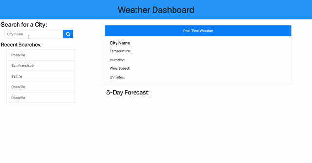

# Weather Dashboard

This repository contains a weather dashboard that displays current and forecast weather for a user selected city.

## Outline of Weather Dashboard

This repository has some unique features, which are outlined below:

1. The app takes a user input city which will return data for a valid entered city.
2. The previous five searches are locally stored and displayed to the user. These are able to be clicked on to search that city again.
3. The current weather is displayed for the selected city (temperature, wind speed, humidity and UV index - with a color indicating how bad it is).
4. A 5 day forecast with the date, temperature and humidity displayed in individual cards.
5. Icons on all weather cards to show the current weather situation.

## Github links

[Homework-6 Github Repository](https://github.com/sean-marten/weather-dashboard)

[Homework-6 Webpage](https://sean-marten.github.io/weather-dashboard/)

## Gif of Webpages

The web page consists of a simple navbar for the highscore navigation. This web page changes dynamically between the start, questions, finish and high score pages. The use of this page is shown in a gif below.

### Webpage in action:

